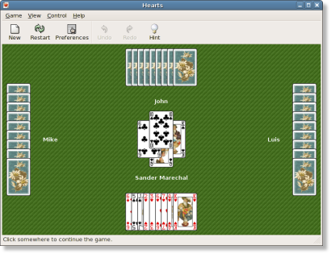
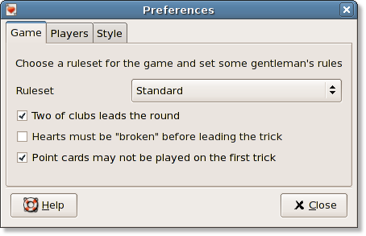
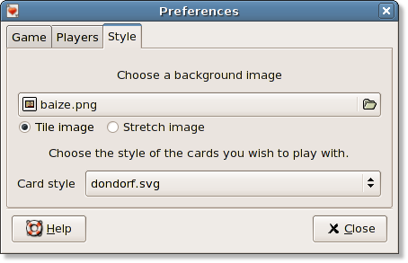

#  Hearts User Documentation

Source: <https://www.jejik.com/gnome-hearts/users/>

This User Documentation gives an overview of how to install, run and play the Hearts game and how you
can customize it to your personal preferences. It is still in the process of being written and some
of the features described in here may not be implemented yet. If you feel like contributing you'll
probabely want to read the [Developer Guidelines](https://www.jejik.com/gnome-hearts/developers/).

## 0: Table of contents

- 1: Installation instructions
  - 1.1: Binary releases
  - 1.2: From source
- 2: Playing the game
- 3: Menus
  - 3.1: Game
  - 3.2: View
  - 3.3: Control
  - 3.4: Help
- 4: Preferences
  - 4.1: Rules
  - 4.2: Opponents
  - 4.3: Style

## 1: Installation instructions

### 1.2: Binary releases

We do not create binray releases ourselves. However, various Linux
distributions have created binary packages for gnome-hearts, such as
[Debian](http://packages.debian.org/etch/gnome-hearts),
[Ubuntu](http://packages.ubuntu.com/feisty/games/gnome-hearts),
[Foresight Linux (rPath)](http://www.rpath.com/rbuilder/repos/foresight/troveInfo?t=gnome-hearts;v=%2Fforesight.rpath.org%40fl%3A1-contrib%2F0.1.3-1-1)
and others. In addition to that, we have built some unofficial binary packages for
Ubuntu Dapper Drake. You can find those packages on the [download](https://www.jejik.com/hearts/download) page.

### 1.2: From source

If you want to compile gnome-hearts from source, you will
need to have the following packages installed on your system:

- gnome 2
- libgnomeui (plus headers)
- libglade2 (plus headers)
- python2.3 or better (plus headers)

Download the tar.gz package for the latest release from the
[download](https://www.jejik.com/gnome-hearts/download) page and extract it somewhere convenient.

```
$ tar -zxvf gnome-hearts-0.2.tar.gz
```

Then you must configure, make and install the package. If you have all the requirements installed then on most systems
you can simply do:

```
$ cd gnome-hearts-0.2
$ ./configure
$ make
$ sudo make install
$ make clean
```

If you want Gnome Hearts to use the card styles you have installed for the gnome-games package then you need to
set the same --prefix on configure as gnome-games is installed with. On most systems this is:

```
$ configure --prefix=/usr
```

## 2: Playing the game

Gnome Hearts is a trick-taking game played with four players. The object of the game is to gain as few point cards
as possible, with the point cards usually being all the hearts and the Queen of spades (see
[Chapter 4.1: Rules](#41-rules) for detailed information). As soon as one player reaches a set number of points
(usually 100) the game is over and the player with the lowest score is declared the winner.



The game is played with four players with you being the south player. Each round starts with selecting three cards
that you wish to pass to another player. In the first round the cards are passed to the left, in the second round
across the table, in the third round to the right, in the fourth round no cards are passed, after which the
sequence repeats. You can (de)select cards in your hand by clicking on them. When you have selected three cards,
click on the player you should pass them to.

After the passing stage one player (usually the one that has been dealt the two of clubs) opens the trick. Each player
must play a card that matches the suit of the first card played on the trick. If they have no more cards of that suit
then they are free to play any card. After all four players have played a card, the trick goes to the player with the
highest card who's suit matches the opening suit. The trick-taker then opens the next trick. When all cards have
been player, each player is given a score depending on the cards that they have taken in their tricks. When one player
reaches 100 points the game is over and the player with the lowest score is declared the winner.

There are two ways to lower your score. You can try to "shoot the moon". That is, to take all the hearts cards
and the Queen of spades. A risky strategy because if you manage to get all but one, you will get a high number of points.
The second way is called "shooting the sun" and involves not only taking all the hearts, but all the cards
in the game.

## 3: Menus

### 3.1: Game

- New: Start a new game
- Restart: Restart the current round of the game
- Scores: View the score table
- Preferences: Edit the game's rules and preferences
- Quit: Quit the game

### 3.2: View

- Fullscreen: Toggle fullscreen mode
- Toolbar: Show or hide the toolbar
- Statusbar: Show or hide the statusbar

### 3.3: Control

- Undo: Undo the last move
- Redo: Replay a previously undone move
- Hint: Have the computer give you a hint on what you should do

### 3.4: Help

- Help: View the Gnome Hearts documentation with the Gnome help browser (yelp)
- About: Show information about Hearts

## 4: Preferences

### 4.1: Rules



This section allows you to set and tweak various game rules. The ruleset is a basic package of rules for the hearts game.
On top of that you can set some "gentleman's rules". Hearts currently has four rulesets, but more rulesets
are planned.

**Standard**
Under the standard rules, all hearts are worth 1 point and the Queen of spades is worth 13 points.
The game ends as soon as the first player has reached 100 points. Shooting the sun lowers your score by
26 points and shooting the sun lowers it by 52 points.

**Omnibus**
This ruleset has the same point cards as the standard rules but also has a bonus card: the Jack of
diamonds. The player that takes this card can deduct 10 points from his or her score.

**Omnibus Alternative**
This is pretty much the same as the Omnibus rules, but with the 10 of diamonds
being the bonus card.

**Spot Hearts**
Under this ruleset, each hearts card is worth it's face value with the Jack being 11 points,
the Queen 12 points, the King 13 points and the Ace 14 points. The Queen of spades is worth 25 points and the game
ends with the first player reaching 500 points. Shooting the sun lowers your score by 129 points
and shooting the sun lowers it by 258 points.

### 4.2: Opponents

Here you can select which opponents you wish to play agaist. If you want the computer to pick for you, choose
&lt;random&gt; from the list. It is very easy to add new opponents or share modified opponents with other Hearts
players. All opponents are implemented in separate [Python](http://www.python.org) scripts. Python is a
powerfull scripting laguage used in all kinds on applications. You can simply copy new Python scripts into the /scripts/players
directory and the new players become available in this menu. For more information about creating and editing Hearts
opponents with Python, see the Developer Guidelines [Chapter 4.2: The player scripts](https://www.jejik.com/gnome-hearts/developers/#4_2).
*Note: The &lt;random&gt; function has not been implemented yet.*

### 4.3: Style



On this tab you can set a background image and choose a card set. Note that some of the card styles that come with
the gnome-games package are Scalable Vector Graphics files (SVG) and can be slow to load.
